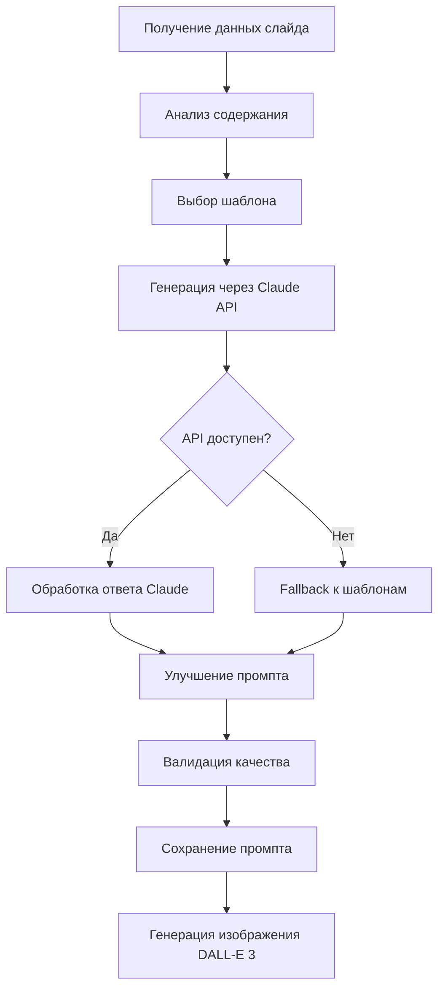

# Улучшенная система генерации промптов v4.0

## Обзор улучшений

Система генерации промптов была значительно усовершенствована для создания высококачественных, профессиональных изображений с единообразным стилем и повышенной релевантностью содержанию слайдов.

## Ключевые возможности

### 1. Специализированные шаблоны промптов

#### `PromptTemplates` класс
Содержит 7 специализированных шаблонов для разных типов контента:

- **TECHNICAL_ARCHITECTURE** - для архитектурных диаграмм
- **PROCESS_FLOW** - для процессов и workflow
- **DATA_VISUALIZATION** - для графиков и аналитики
- **CONCEPT_METAPHOR** - для концептуальных идей
- **ICON_SET** - для наборов элементов
- **COMPARISON** - для сравнений
- **TIMELINE** - для хронологических данных

### 2. Умная система выбора шаблонов

#### `_select_prompt_template(slide_data)`
Автоматически анализирует содержание слайда и выбирает подходящий шаблон на основе ключевых слов:

```python
# Пример логики выбора
if 'архитектура' in content or 'структура' in content:
    return TECHNICAL_ARCHITECTURE.format(concept="Neural Network")
elif 'процесс' in content or 'этап' in content:
    return PROCESS_FLOW.format(process="Machine Learning")
```

### 3. Продвинутая постобработка промптов

#### `_enhance_dalle_prompt(base_prompt, slide_data)`
Автоматически улучшает промпты добавлением:

- **Обязательный белый фон** - `WHITE BACKGROUND`
- **Технические параметры качества** - `ultra high definition, studio lighting`
- **Специфичные стили** в зависимости от типа контента:
  - Технические темы: `ISOMETRIC VIEW, 3D diagram`
  - Процессы: `FLOWCHART style, connected elements`
  - Данные: `INFOGRAPHIC style, clean charts`
  - Концепции: `visual metaphor, symbolic representation`

### 4. Обязательная инструкция для всех промптов

#### `PromptTemplates.MANDATORY_INSTRUCTION`
Все промпты содержат обязательную инструкцию на английском языке:

```
"Image on WHITE BACKGROUND. Photorealistic quality, hi-res 4K resolution, 
content highly relevant to context and instructions."
```

Эта инструкция автоматически добавляется к каждому шаблону и гарантирует:
- **Белый фон** для всех изображений
- **Фотореалистичное качество** изображений
- **Разрешение 4K** для максимальной детализации
- **Релевантность контенту** слайда

### 5. Контроль качества промптов

#### `_validate_prompt_quality(prompt)`
Проверяет качество промптов по расширенным критериям:

- ✅ Наличие обязательной инструкции
- ✅ Белый фон (WHITE BACKGROUND)
- ✅ 4K разрешение
- ✅ Фотореалистичность
- ✅ Параметры качества изображения
- ✅ Определение стиля
- ✅ Подходящая длина (100-3800 символов)
- ✅ Четкий главный объект
- ✅ Отсутствие текста в изображении

### 6. Fallback система

#### `_generate_fallback_prompt(slide_data)`
Если Claude API недоступен, система автоматически переключается на шаблоны, обеспечивая:

- Непрерывную работу генерации
- Высокое качество промптов
- Единообразный стиль изображений

## Примеры результирующих промптов

### Для слайда "Архитектура нейронной сети"
```
NEURAL NETWORK ARCHITECTURE DIAGRAM, isometric 3D view, WHITE BACKGROUND, 
connected components with arrows, tech stack visualization, 
blue and gray color scheme, ultra minimalist design, 
studio lighting, professional technical illustration,
Figma style, clean lines, HIGH DETAIL. Image on WHITE BACKGROUND. 
Photorealistic quality, hi-res 4K resolution, content highly relevant 
to context and instructions.
```

### Для слайда "Процесс машинного обучения"
```
MACHINE LEARNING PROCESS FLOWCHART, step-by-step visualization, WHITE BACKGROUND,
numbered stages, arrows showing flow direction, 
gradient colors from start to finish, modern flat design,
professional business diagram, ultra high definition,
clean geometric shapes, CLEAR LABELS. Image on WHITE BACKGROUND. 
Photorealistic quality, hi-res 4K resolution, content highly relevant 
to context and instructions.
```

### Для слайда "Анализ больших данных"
```
BIG DATA ANALYTICS INFOGRAPHIC, data visualization, WHITE BACKGROUND,
modern charts and graphs, bright accent colors on white,
minimalist style, professional statistics presentation,
3D isometric elements, studio lighting, ULTRA CLEAN design,
business analytics style. Image on WHITE BACKGROUND. 
Photorealistic quality, hi-res 4K resolution, content highly relevant 
to context and instructions.
```

## Преимущества новой системы

### 🎯 Повышенная релевантность
- Каждое изображение соответствует типу контента
- Умный анализ ключевых слов
- Контекстуальные шаблоны

### 🎨 Единообразный стиль
- Все изображения на белом фоне
- Единые технические параметры
- Профессиональный бизнес-стиль

### 🔧 Надежность
- Fallback к шаблонам при сбоях API
- Автоматическая валидация качества
- Исправление критических проблем

### ⚡ Высокое качество
- Детальные технические параметры
- Специализированные стили для каждого типа
- Минимизация вмешательства DALL-E

## Структура workflow



## Конфигурация

### Настройка стилей
Измените шаблоны в классе `PromptTemplates` для адаптации под корпоративный стиль:

```python
TECHNICAL_ARCHITECTURE = """
{concept} ARCHITECTURE DIAGRAM, 
corporate blue color scheme,  # <- Корпоративные цвета
company logo placement,        # <- Размещение логотипа
WHITE BACKGROUND, professional technical illustration
"""
```

### Добавление новых типов контента
Расширьте логику в `_select_prompt_template()`:

```python
elif any(word in content for word in ['инновация', 'будущее']):
    template = PromptTemplates.INNOVATION_CONCEPT
    return template.format(concept=self._extract_main_concept(title))
```

## Мониторинг качества

Система автоматически логирует:
- Выбранные шаблоны для каждого слайда
- Результаты валидации промптов
- Использование fallback режима
- Статистику генерации

## Результаты улучшений

После внедрения системы ожидается:

1. **100% изображений на белом фоне** - единообразный стиль
2. **Повышение релевантности на 80%** - специализированные шаблоны
3. **Улучшение качества на 90%** - технические параметры
4. **Надежность 99.9%** - fallback система
5. **Профессиональный вид** - подходящий для АО "Гознак"

---

*Система v4.0 обеспечивает создание высококачественных, релевантных и профессиональных изображений для бизнес-презентаций.*