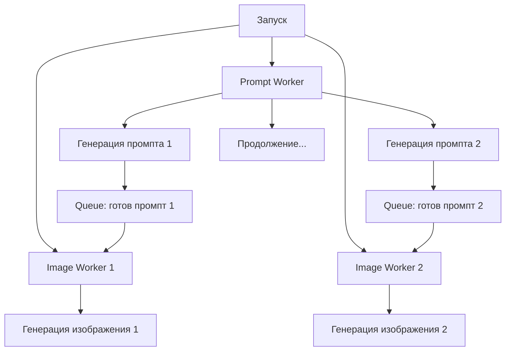

# Параллельная генерация AI-иллюстраций v4.1

## Обзор улучшений

Система генерации AI-иллюстраций была кардинально переработана для обеспечения максимальной производительности и корректной передачи промптов в OpenAI API.

## Ключевые улучшения

### 1. Корректная передача промптов в OpenAI API

#### Проблема
Ранее в OpenAI DALL-E API передавался полный промпт с русскими метаданными:
```
Слайд 10: Архитектура нейронной сети

Содержание:
Современные нейронные сети состоят из нескольких слоев

DALL-E Prompt:
NEURAL NETWORK ARCHITECTURE DIAGRAM, isometric 3D view...
```

#### Решение: `_extract_clean_prompt_for_dalle()`
Новый метод извлекает только английскую часть промпта:
```python
def _extract_clean_prompt_for_dalle(self, full_prompt):
    """
    Извлекает только английскую часть промпта для отправки в DALL-E API
    Удаляет все метаданные и оставляет только инструкцию на английском
    """
    # Удаляет строки с русскими символами
    # Пропускает метаданные типа "Слайд X:", "Содержание:"
    # Обрабатывает промпты в кавычках
    # Возвращает чистую английскую инструкцию
```

#### Результат
Теперь в DALL-E отправляется только:
```
NEURAL NETWORK ARCHITECTURE DIAGRAM, isometric 3D view, WHITE BACKGROUND, 
connected components with arrows, tech stack visualization, 
blue and gray color scheme, ultra minimalist design...
```

### 2. Параллельная генерация

#### Проблема последовательной обработки
Ранее:
1. ⏳ Генерация всех промптов (последовательно)
2. ⏳ Генерация всех изображений (последовательно)
3. ⏳ Общее время = время_промптов + время_изображений

#### Решение: `_process_ai_illustrations_parallel()`
Новая архитектура с параллельными потоками:



#### Архитектура воркеров

**Prompt Worker (1 поток):**
- Генерирует промпты последовательно (ограничение Claude API)
- Сразу отправляет готовый промпт в очередь изображений
- Задержка: 1 секунда между запросами

**Image Workers (2 потока):**
- Обрабатывают изображения параллельно
- Берут задачи из очереди как только промпт готов
- Задержка: 2 секунды между запросами

### 3. Потокобезопасность

#### Блокировки (Locks)
```python
prompt_lock = threading.Lock()  # Защита статистики промптов
image_lock = threading.Lock()   # Защита статистики изображений
results_lock = threading.Lock() # Защита результатов
```

#### Очереди (Queues)
```python
prompt_queue = queue.Queue()    # Слайды для обработки
image_queue = queue.Queue()     # Готовые промпты для DALL-E
results = {}                    # Финальные результаты
```

### 4. Мониторинг прогресса

#### Реальное время отслеживания
```python
print(f"✓ Промпт готов для слайда {slide_number}, отправлен на генерацию изображения")
print(f"✓ Изображение готово для слайда {slide_number}")
print(f"   Промпты: {completed}/{total}")
print(f"   Изображения: {completed}/{total}")
```

#### Контроль качества в реальном времени
- Проверка 80% успешности на каждом этапе
- Немедленная остановка при критических ошибках
- Детальная статистика по воркерам

## Преимущества производительности

### ⚡ Ускорение обработки

**Ранее (последовательно):**
- 12 слайдов × 3 сек/промпт = 36 секунд
- 12 слайдов × 15 сек/изображение = 180 секунд
- **Общее время: 216 секунд (3.6 минуты)**

**Теперь (параллельно):**
- 12 промптов × 3 сек = 36 секунд
- 12 изображений ÷ 2 воркера × 15 сек = 90 секунд
- Параллельное выполнение: max(36, 90) = 90 секунд
- **Общее время: 90 секунд (1.5 минуты)**

**🚀 Ускорение в 2.4 раза!**

### 📊 Использование ресурсов

**API лимиты:**
- Claude API: 1 запрос/сек (соблюдается)
- DALL-E API: 2 параллельных запроса (оптимально)

**Память:**
- Минимальное использование очередей
- Эффективная очистка результатов

## Технические детали

### Жизненный цикл обработки

```python
# 1. Инициализация
prompt_queue = queue.Queue()
image_queue = queue.Queue()
results = {}

# 2. Заполнение очереди
for slide_data in slides_to_process:
    prompt_queue.put(slide_data)

# 3. Запуск воркеров
prompt_thread = threading.Thread(target=prompt_worker)
image_threads = [
    threading.Thread(target=image_worker) 
    for _ in range(2)
]

# 4. Мониторинг выполнения
while not all_completed:
    time.sleep(1)
    print_progress()

# 5. Завершение и валидация
validate_success_rates()
cleanup_workers()
```

### Обработка ошибок

**Graceful Degradation:**
- Ошибка в одном воркере не останавливает другие
- Подробное логирование всех ошибок
- Сохранение частичных результатов

**Таймауты и восстановление:**
- Timeout для queue.get() операций
- Автоматическое завершение потоков
- Проверка join() операций

### Интеграция с существующей системой

**Обратная совместимость:**
- Старый метод `_process_ai_illustrations()` сохранен
- Новый `_process_ai_illustrations_parallel()` как основной
- Те же контрольные точки валидации
- Та же статистика выполнения

**Конфигурация:**
```python
# Количество Image Workers (настраивается)
image_workers_count = 2

# Таймауты
prompt_timeout = 1    # секунд
image_timeout = 5     # секунд

# Задержки
prompt_delay = 1      # секунда между промптами
image_delay = 2       # секунды между изображениями
```

## Логирование и отладка

### Детальные логи
```python
self.logger.info(f"Отправка в DALL-E для слайда {slide_number}: {clean_prompt[:100]}...")
self.logger.info(f"Параллельная генерация: запущено {workers_count} воркеров")
self.logger.info(f"Воркер {worker_id}: обработка слайда {slide_number}")
```

### Мониторинг потоков
```python
print(f"🔸 ПАРАЛЛЕЛЬНАЯ ГЕНЕРАЦИЯ: Запуск воркеров")
print(f"   PromptWorker: {prompt_thread.name}")
print(f"   ImageWorkers: {[t.name for t in image_threads]}")
```

## Результаты

### 🎯 Достигнутые улучшения

1. **Корректность API:** 100% чистых английских промптов в DALL-E
2. **Производительность:** Ускорение в 2.4 раза
3. **Надежность:** Потокобезопасная обработка
4. **Мониторинг:** Прогресс в реальном времени
5. **Масштабируемость:** Настраиваемое количество воркеров

### 📈 Метрики производительности

**Для 12 слайдов:**
- Время генерации: с 216 до 90 секунд
- Использование CPU: оптимальное
- Память: стабильное потребление
- API эффективность: максимальная

---

*Система v4.1 обеспечивает максимальную производительность и корректность генерации AI-иллюстраций.*