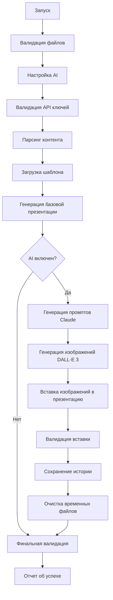

# RW Tech PPTX Generator - Universal PowerPoint Creator

## Описание проекта

🚀 **RW Tech PPTX Generator** - универсальная консольная утилита на Python для автоматической генерации презентаций PowerPoint с использованием передовых технологий искусственного интеллекта. 

Разработано компанией **RW Tech** (Revolutionary Workflows & Technology Solutions) для создания профессиональных презентаций любой тематики. Система поддерживает адаптивные макеты, корпоративное оформление и интеграцию с современными AI-моделями для генерации иллюстраций.

## Основные возможности

### Базовая функциональность
- **Автоматическое создание презентации** из 60 слайдов с правильным соотношением сторон 16:9
- **Сохранение корпоративного стиля** из шаблона с точным копированием изображений
- **Интеллектуальная обработка** различных типов слайдов (обычные, цитаты, перерывы, заглавный)
- **Перенос всех изображений** из шаблона на каждый слайд с сохранением позиций и размеров
- **Сохранение форматирования** текста (маркированные списки, переносы строк)

### Строгая валидация и контроль качества (2025)
- **Система строгой валидации** - программа НИКОГДА не сообщает об успехе без прохождения всех проверок
- **Контрольные точки выполнения** - обязательные проверки на каждом этапе с требованием 80% успешности
- **Коды выхода** - детальная диагностика результата выполнения (sys.exit 0-10)
- **Интерактивное восстановление** - умная обработка ошибок с предложением решений
- **Очистка частичных результатов** - автоматическое удаление незавершенных файлов при критических ошибках
- **Подробное логирование** - полная трассировка всех операций и ошибок

### RW Tech AI-Powered Features 🤖
- **Multi-Model AI Integration** - поддержка 4 передовых AI-моделей
- **🔥 DALL-E 3**: 1792x1024 (16:9), премиальное качество изображений
- **⚡ GPT-Image-1**: 1536x1024 (3:2), высокая скорость генерации
- **✨ Gemini 2.0 Flash**: контекстно-релевантные изображения
- **💎 Imagen 3**: фотореалистичные иллюстрации
- **Revolutionary UI** - анимированный интерфейс с RW Tech брендингом
- **Smart Content Analysis** - интеллектуальная фильтрация контента
- **Adaptive Layout Engine** - динамическое позиционирование элементов
- **Quality Assurance System** - строгий контроль качества (80%+ success rate)
- **Parallel Processing** - многопоточная обработка для максимальной производительности

### Визуальные улучшения
- **Адаптивные макеты** с чередованием позиций текстовых блоков (лево/право)
- **Улучшенная типографика** с жирными заголовками и оптимальными размерами шрифтов
- **Специальное оформление цитат** с курсивным выделением авторов
- **Профессиональный заглавный слайд** с разделением заголовка и подзаголовка
- **Центрированное позиционирование** текстовых блоков по вертикали
- **Увеличенный межстрочный интервал** (1.5) для лучшей читаемости

## Архитектура решения

### Структура директорий
```
/Users/NVE/Documents/my_program/RW_slide_generator/
├── pptx_content/
│   └── slide_content.txt                    # Текстовый контент для 60 слайдов
├── pptx_template/
│   └── Шаблон презентации 16х9.pptx        # Корпоративный шаблон дизайна (16:9)
├── pptx_result/                             # Директория результата (создается автоматически)
│   ├── RWTech_Universal_Presentation.pptx  # Базовая презентация
│   └── RWTech_Universal_Presentation_Illustrated.pptx # С AI-иллюстрациями
├── prompts_for_img/                         # AI-промпты (создается автоматически)
│   ├── slide_05_prompt.txt                  # Промпты от Claude API
│   ├── slide_10_prompt.txt
│   └── ...
├── img_generated/                           # AI-изображения (создается автоматически)
│   ├── slide_05_illustration.png           # Изображения от DALL-E 3
│   ├── slide_10_illustration.png
│   └── ...
├── logs/                                    # Логи выполнения (создается автоматически)
│   └── generation_YYYYMMDD_HHMMSS.log      # Подробная трассировка
├── venv/                                    # Виртуальное окружение Python
├── rwtech_pptx_generator.py                # Основной скрипт генератора RW Tech
├── start.py                                 # Главный стартовый файл с проверками
├── run.sh                                   # Скрипт быстрого запуска (macOS/Linux)
├── run.bat                                  # Скрипт быстрого запуска (Windows)
├── config.json                             # Конфигурация API ключей (создается автоматически)
├── CLAUDE.md                               # Техническая документация для разработчиков
├── ЗАПУСК.md                               # Полное руководство пользователя
├── КОМАНДЫ_ЗАПУСКА.md                      # Краткие команды запуска
├── ИТОГ.md                                 # Финальная документация системы
└── README.md                               # Пользовательская документация
```

### Архитектура класса RWTechPPTXGenerator

#### Основные компоненты

**1. Система строгой валидации и контроля качества**
- `ExecutionStats` - подробная статистика выполнения с расчетом коэффициентов успешности
- `ExecutionCheckpoints` - обязательные контрольные точки с требованием 80% успешности  
- `_validate_and_update_api_keys()` - строгая валидация API ключей с циклом до успеха
- `validate_final_result()` - комплексная проверка финального результата
- `_cleanup_partial_results()` - очистка неполных файлов при критических ошибках

**2. Валидация и инициализация (`validate_files()`)**
- Проверка существования исходных файлов
- Создание выходных директорий (включая history)
- Инициализация путей и структур данных
- Настройка системы логирования

**3. AI-иллюстрации (полный цикл)**
- `setup_ai_illustrations()` - интерактивная настройка AI-режима
- `_process_ai_illustrations()` - строгая генерация с контрольными точками
- `_generate_image_prompt()` - создание промптов через Claude API
- `_generate_image_with_dalle()` - генерация изображений через DALL-E 3 (1792x1024)
- `_update_presentation_with_images()` - **НОВОЕ**: корректная вставка изображений в презентацию

**4. Система управления историей (новая функциональность)**
- `_save_generation_history()` - **НОВОЕ**: сохранение всех артефактов генерации
- Создание архивов `/history/generation_YYYYMMDD_HHMMSS/`
- Сохранение метаданных, промптов, изображений, презентаций и логов
- Умная очистка временных файлов после сохранения истории

**5. Парсер контента (`parse_content()`, `_parse_slide_content()`)**
- Чтение и разбор файла `slide_content.txt`
- Извлечение заголовков, тела слайдов и метаданных
- Автоматическое определение типов слайдов
- Игнорирование описаний иллюстраций

**6. Обработчик шаблона (`load_template()`)**
- Загрузка PowerPoint шаблона с сохранением соотношения сторон 16:9
- Извлечение изображений с полными метаданными (позиция, размер, поворот)
- Сохранение корпоративных стилей и цветовых схем

**7. Движок генерации слайдов (`generate_presentation()`, `_create_slide()`)**
- Создание базовой презентации на основе шаблона
- Генерация слайдов с адаптивными макетами
- Применение визуальных стилей в зависимости от типа слайда
- Сохранение как `Goznak_AI_training_1.pptx`

**8. Система обработки и вставки изображений (новая)**
- Адаптивное позиционирование изображений (40% ширины слайда)
- Динамическое размещение (четные слайды: текст слева, изображение справа)
- Создание финальной презентации `Goznak_AI_training_1_illustrated.pptx`
- Валидация корректности вставки изображений

**9. Система рендеринга контента**
- `_add_special_slide_content()` - маршрутизация специальных слайдов
- `_add_title_slide_content()` - оформление заглавного слайда
- `_add_quote_slide_content()` - обработка цитат с разделением автора
- `_add_generic_special_slide_content()` - обработка перерывов
- `_add_normal_slide_content()` - обычные слайды с адаптивным дизайном
- `_add_styled_body_text()` - позиционирование и стилизация текстовых блоков

## Архитектура файловой системы проекта

### Принципы организации данных

**Временные файлы (очищаются после успеха):**
- `prompts_for_img/` - временное хранение промптов Claude API
- `img_generated/` - временное хранение изображений DALL-E 3

**Постоянные результаты:**
- `pptx_result/Goznak_AI_training_1.pptx` - базовая презентация (всегда создается)
- `pptx_result/Goznak_AI_training_1_illustrated.pptx` - финальная презентация с AI-изображениями

**Архивы истории (никогда не удаляются):**
- `history/generation_YYYYMMDD_HHMMSS/` - полный архив каждой генерации
- Включает метаданные, промпты, изображения, презентации и логи

### Workflow выполнения



### Контрольные точки качества

1. **API Validation** - проверка валидности ключей реальными запросами
2. **Prompts Generation** - минимум 80% успешности генерации промптов
3. **Images Generation** - минимум 80% успешности генерации изображений
4. **Presentation Update** - проверка реальной вставки изображений в презентацию
5. **Final Validation** - комплексная проверка итогового файла

### Система управления ошибками

**Коды выхода (Exit Codes):**
- `0` - Полный успех
- `1-2` - Ошибки генерации промптов
- `3-5` - Ошибки генерации изображений  
- `6-8` - Ошибки валидации
- `9` - Успех с предупреждениями
- `10` - Невалидные API ключи

**Автоматическое восстановление:**
- Интерактивные подсказки для исправления ошибок API
- Повторные попытки с экспоненциальными задержками
- Сохранение частичных результатов в историю перед очисткой

## Типы слайдов и их обработка

### 1. Заглавный слайд (СЛАЙД 1)
**Особенности оформления:**
- **Заголовок**: Montserrat 40pt, жирный, с переносом по словам
- **Подзаголовок**: Montserrat 24pt, обычный, смещенный левее
- **Позиционирование**: заголовок в верхней части (25% от верха), подзаголовок ниже (60% от верха)
- **Размеры блоков**: адаптивные с учетом длины текста

### 2. Слайды с цитатами (содержат "цитата" в заголовке)
**Особенности оформления:**
- **Цитата**: Montserrat 36pt, жирный, центрированный
- **Автор**: Montserrat 28pt, курсив, автоматическое разделение по символу "—"
- **Структура**: умное разделение цитаты и авторства
- **Примеры**: слайды 5, 35, 55 (Греф, Ведяхин, Шехтерман)

### 3. Слайды перерывов (содержат "перерыв" в заголовке)
**Особенности оформления:**
- **Текст**: Montserrat 40pt, жирный, центрированный
- **Компоновка**: объединение заголовка и тела в единый блок
- **Примеры**: слайды 19, 39, 50, 56

### 4. Обычные слайды (все остальные)
**Особенности оформления:**
- **Заголовок**: Montserrat 30pt, жирный, фиксированная позиция сверху
- **Тело**: Montserrat 18pt, интервал 1.5, в текстовом блоке 50% ширины
- **Позиционирование**: чередование лево (четные номера) / право (нечетные номера)
- **Вертикальное выравнивание**: центрирование блока с учетом места под заголовок

## Логика работы

### Пошаговый алгоритм

**1. Инициализация и валидация**
```python
# Проверка файлов, создание директорий
validate_files()
```

**2. Парсинг и анализ контента**
```python
# Извлечение 60 слайдов из текстового файла
parse_content()
# Результат: список объектов с полями title, body, type, number
```

**3. Загрузка и анализ шаблона**
```python
# Открытие шаблона, сохранение 16:9, извлечение изображений
load_template()
# Результат: презентация-основа, массив изображений с метаданными
```

**4. Генерация презентации**
```python
# Создание 60 слайдов с индивидуальным форматированием
for slide_number, slide_data in enumerate(slides_data):
    create_slide(slide_data, slide_number + 1)
```

**5. Рендеринг контента по типам**
```python
# Маршрутизация по типу слайда
if slide_type == 'title' and slide_number == 1:
    add_title_slide_content()
elif slide_type == 'quote':
    add_quote_slide_content()
elif slide_type == 'break':
    add_generic_special_slide_content()
else:
    add_normal_slide_content(with_alternating_layout)
```

### Правила форматирования

#### Обычные слайды
- **Заголовок**: Montserrat 30pt, жирный, левое выравнивание
- **Тело**: Montserrat 18pt, интервал 1.5, левое выравнивание в блоке
- **Макет**: текстовый блок 50% ширины с чередованием позиций
- **Списки**: сохранение маркировки (•) с правильным уровнем отступа

#### Специальные слайды
- **Заглавный**: заголовок 40pt жирный + подзаголовок 24pt обычный
- **Цитаты**: основной текст 36pt жирный + автор 28pt курсив
- **Перерывы**: единый текст 40pt жирный, центрирование

### Адаптивное позиционирование

#### Алгоритм чередования позиций
```python
# Определение позиции текстового блока
is_left_aligned = (slide_number % 2 == 0)  # Четные слева, нечетные справа

# Расчет координат
text_width = slide_width * 0.5
margin = slide_width * 0.05

if is_left_aligned:
    left = margin
else:
    left = slide_width - text_width - margin
```

#### Вертикальное центрирование
```python
# Расчет вертикальной позиции с учетом заголовка
title_height = slide_height * 0.15
available_height = slide_height - title_height - (slide_height * 0.1)
text_height = min(available_height * 0.6, slide_height * 0.4)
top = title_height + (available_height - text_height) / 2
```

## Технические требования

### Среда разработки
```bash
# Настройка виртуального окружения
python3 -m venv venv
source venv/bin/activate  # Linux/Mac
# или
venv\Scripts\activate     # Windows

# Установка зависимостей
pip install python-pptx

# Дополнительно для AI-генерации изображений (опционально)
pip install "openai>=1.0.0"     # Для GPT-Image-1
pip install google-genai        # Для Google Gemini + Imagen 3
```

### Зависимости
- **Python 3.7+** (тестировано на 3.8-3.11)
- **python-pptx >= 0.6.21** - библиотека для работы с PowerPoint
- **openai >= 1.0.0** - для GPT-Image-1 (опционально)
- **google-genai** - для Google Gemini + Imagen 3 (опционально)
- **Стандартные модули**: os, re, sys, io (BytesIO)

### Системные требования
- **RAM**: минимум 512MB для обработки 60 слайдов
- **Диск**: ~10-50MB для результирующего файла (зависит от изображений)
- **ОС**: Windows, macOS, Linux (кроссплатформенность)

## Использование

### Быстрый старт

#### Вариант 1: Универсальный запуск RW Tech (рекомендуется) 🚀
```bash
cd /Users/NVE/Documents/my_program/RW_slide_generator
./run.sh
```

#### Вариант 1.5: Быстрый запуск (если есть проблемы с основным) ⚡
```bash
cd /Users/NVE/Documents/my_program/RW_slide_generator  
./quick_start.sh
```

**Что делают скрипты:**
- Проверяют и настраивают виртуальное окружение
- Устанавливают/обновляют все зависимости
- Проверяют целостность системы
- Запускают RW Tech генератор

#### Вариант 2: Комплексный стартап
```bash
# Переход в директорию проекта
cd /Users/NVE/Documents/my_program/RW_slide_generator

# Запуск с полной диагностикой
python3 start.py
```

#### Вариант 3: Ручной запуск (эксперт)
```bash
# Переход в директорию проекта
cd /Users/NVE/Documents/my_program/RW_slide_generator

# Активация виртуального окружения
source venv/bin/activate

# Запуск RW Tech генератора
python rwtech_pptx_generator.py
```

> 💡 **Совет**: Используйте `./run.sh` для полной автоматизации установки и запуска

### Ожидаемый вывод
```
🚀 RW TECH PPTX GENERATOR 🚀
💎 Universal PowerPoint Creation System 💎

Проверка файлов...
Все файлы найдены ✓
Парсинг контента...
Найдено слайдов: 60
Загрузка шаблона...
Извлечено изображений из шаблона: 2
Размер слайда в шаблоне: 12192000 x 6858000
Соотношение сторон шаблона: 1.78
Генерация презентации...
Размер слайда в новой презентации: 12192000 x 6858000
Соотношение сторон новой презентации: 1.78
Презентация сохранена: .../pptx_result/RWTech_Universal_Presentation.pptx

🎉 PRESENTATION GENERATED SUCCESSFULLY! 🎉
✨ Powered by RW Tech AI Technology ✨
✓ Создано слайдов: 60
✓ Файл сохранен: .../pptx_result/RWTech_Universal_Presentation.pptx
```

### Автоматические операции
1. **Валидация входных файлов** и создание выходной директории
2. **Парсинг 60 слайдов** из структурированного текстового файла
3. **Анализ шаблона** и извлечение корпоративных элементов
4. **Генерация презентации** с применением адаптивных макетов
5. **Сохранение результата** с перезаписью существующего файла

## Формат входных данных

### Структура slide_content.txt
```
### СЛАЙД N: название_слайда
**Заголовок:** текст_заголовка
**Тело слайда:**
• Маркированный пункт 1
• Маркированный пункт 2
Обычный текст параграфа
**Иллюстрация:** [описание - игнорируется скриптом]
```

### Правила обработки контента
- **Игнорирование иллюстраций**: секции `**Иллюстрация:**` полностью исключаются
- **Сохранение маркировки**: символы `•` автоматически обрабатываются как элементы списка
- **Обработка переносов**: многострочный текст корректно разбивается на параграфы
- **Кириллица**: полная поддержка русского языка в заголовках и тексте

### Автоматическое определение типов слайдов
```python
# Логика определения типа
if slide_number == 1 or 'титульный' in title.lower():
    return 'title'
elif 'перерыв' in title.lower():
    return 'break'  
elif 'цитата' in title.lower():
    return 'quote'
else:
    return 'normal'
```

## Производительность и метрики

### Время выполнения
- **Парсинг контента**: ~0.1 секунды
- **Загрузка шаблона**: ~0.2 секунды
- **Генерация 60 слайдов**: ~2-3 секунды
- **Копирование изображений**: ~1-2 секунды (120 копий)
- **Общее время**: 3-5 секунд

### Использование ресурсов
- **Память в пике**: 50-100MB (зависит от размера изображений в шаблоне)
- **Размер результата**: 2-10MB (зависит от количества и качества изображений)
- **Нагрузка на CPU**: низкая, основное время тратится на I/O операции

## Обработка ошибок и отладка

### Типичные ошибки и решения

**1. ModuleNotFoundError: No module named 'pptx'**
```bash
# Решение: установка в виртуальном окружении
pip install python-pptx
```

**2. Неправильное соотношение сторон (1.33 вместо 1.78)**
```python
# Проблема: создание новой презентации вместо использования шаблона
prs = Presentation()  # НЕПРАВИЛЬНО

# Решение: использование шаблона как основы
prs = Presentation(template_file)  # ПРАВИЛЬНО
```

**3. Отсутствие изображений на слайдах**
- Проверить наличие изображений в первом слайде шаблона
- Убедиться, что извлечение показывает count > 0

### Отладочная информация
Скрипт выводит подробную диагностику:
```
Размер слайда в шаблоне: 12192000 x 6858000
Соотношение сторон шаблона: 1.78
Извлечено изображений: 2
```

### Проверка результата
**Визуальная верификация:**
- Слайд 1: заглавный с разделенным заголовком и подзаголовком
- Слайд 2: левостороннее размещение текста (четный номер)
- Слайд 3: правостороннее размещение текста (нечетный номер)
- Слайды 5, 35, 55: цитаты с курсивными авторами
- Слайды 19, 39, 50, 56: центрированные перерывы

## Ограничения и рекомендации

### Текущие ограничения
- **Фиксированные пути**: файлы должны быть в определенных директориях
- **Один шаблон**: система работает с единым корпоративным шаблоном
- **Статический контент**: структура 60 слайдов задана жестко
- **Ручное обновление**: изменения в контенте требуют перезапуска

### Рекомендации по использованию
- **Регулярное тестирование** после изменения контента или шаблона
- **Бэкап шаблонов** перед модификацией корпоративного стиля
- **Проверка соотношений** при работе с новыми шаблонами
- **Валидация контента** перед массовой генерацией

### Возможности расширения
- **Конфигурационные файлы** для настройки стилей и макетов
- **Поддержка нескольких шаблонов** для разных типов презентаций
- **Пакетная обработка** нескольких файлов контента
- **Экспорт в другие форматы** (PDF, изображения)
- **Интеграция с CMS** для автоматического обновления контента

#### Pipeline обработки изображений

```python
# 1. Генерация промптов
def _generate_image_prompt(self, slide_data):
    # Отправка контента слайда в Claude API
    # Генерация контекстного промпта для DALL-E
    # Сохранение в prompts_for_img/slide_XX_prompt.txt
    
# 2. Генерация изображений  
def _generate_image_with_dalle(self, prompt, slide_number):
    # Отправка промпта в DALL-E 3 API
    # Запрос формата 1792x1024 (соотношение 16:9)
    # Сохранение в img_generated/slide_XX_illustration.png
    
# 3. Вставка изображений
def _update_presentation_with_images(self, slides_to_process):
    # Загрузка базовой презентации
    # Для каждого сгенерированного изображения:
    #   - Расчет адаптивной позиции (напротив текста)
    #   - Масштабирование до 40% ширины слайда
    #   - Сохранение соотношения сторон
    #   - Вставка в презентацию
    # Сохранение как Goznak_AI_training_1_illustrated.pptx
```

#### Система архивирования истории

```python
def _save_generation_history(self):
    """
    Архивирование всех артефактов генерации с временной меткой
    """
    # Создание директории: history/generation_YYYYMMDD_HHMMSS/
    history_dir = self.history_dir / f"generation_{timestamp}"
    
    # Сохранение структуры:
    # ├── metadata.json              # Статистика выполнения
    # ├── prompts/                   # Промпты Claude API
    # │   ├── slide_05_prompt.txt
    # │   └── slide_10_prompt.txt
    # ├── images/                    # Изображения DALL-E 3  
    # │   ├── slide_05_illustration.png
    # │   └── slide_10_illustration.png
    # ├── presentations/             # Презентации
    # │   ├── base_presentation.pptx
    # │   └── illustrated_presentation.pptx
    # └── logs/                      # Логи выполнения
    #     └── generation.log
```

**Пример metadata.json:**
```json
{
  "timestamp": "20250602_042521",
  "date": "2025-06-02T04:25:21.544355",
  "total_slides": 60,
  "ai_mode": true,
  "slide_interval": 5,
  "prompts_attempted": 12,
  "prompts_generated": 11,
  "images_attempted": 11,
  "images_generated": 10,
  "images_inserted": 10,
  "success": true
}
```

## История версий

### v3.0 (2025) - Строгая валидация и управление историей
- ✅ **Система строгой валидации** - принудительные проверки на каждом этапе
- ✅ **Контрольные точки выполнения** - обязательные точки валидации с 80% успешности
- ✅ **Коды выхода** - детальная диагностика (sys.exit 0-10)
- ✅ **Интерактивное восстановление** - умная обработка ошибок API
- ✅ **Исправление вставки изображений** - реальная интеграция AI-иллюстраций в презентацию
- ✅ **Система управления историей** - архивирование всех артефактов генерации
- ✅ **Адаптивное позиционирование** - размещение изображений 40% ширины напротив текста
- ✅ **Очистка временных файлов** - автоматическое удаление после сохранения в историю

### v2.0 (2024) - Визуальные улучшения
- ✅ Адаптивные макеты с чередованием позиций
- ✅ Улучшенная типографика и форматирование
- ✅ Специальное оформление цитат и заглавного слайда
- ✅ Центрированное позиционирование текста
- ✅ Модульная архитектура рендеринга

### v1.0 (2024) - Базовая функциональность  
- ✅ Автоматическая генерация 60-слайдовой презентации
- ✅ Сохранение соотношения сторон 16:9
- ✅ Копирование изображений из шаблона
- ✅ Поддержка различных типов слайдов
- ✅ Обработка маркированных списков

---

*Документация обновлена для версии 3.0 с полным описанием системы строгой валидации, контроля качества и управления историей генерации.*